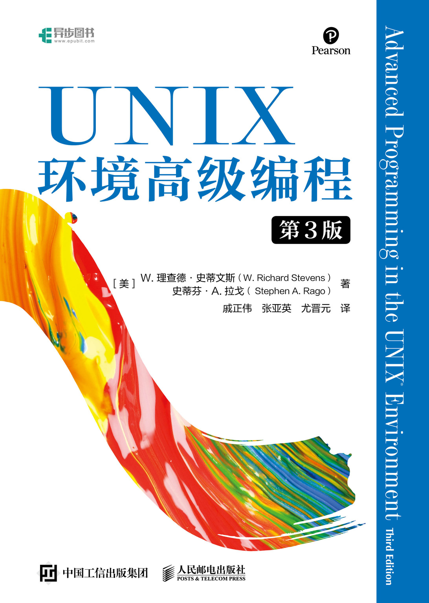

## UNIX环境高级编程 第3版-请立即点赞

[本书在人民邮电出版社的介绍](https://www.ptpress.com.cn/shopping/buy?bookId=b14ca98e-9fb3-464a-8563-cc6ec8aa7505) [电子工业出版社京东自营官方旗舰店 本书购买链接](https://item.jd.com/14186183.html)

[](https://cloudstudio.net/a/22191714338902016?channel=share&sharetype=Markdown)

[美]W. 理查德·史蒂文斯(W. Richard Stevens)史蒂芬·A. 拉戈( Stephen A. Rago)

**本书内容概念清晰,阐述精辟,对于"想到北京求职高薪售前工程师"的同学均可适用.**

```bash
Makefile 帮助信息 v2000_id_2016 :
提交id_v2170

0_更新到最新版本
  : 与git仓库同步最新内容(首先执行这里)
9_check
  : 判断是否处于cloudstudio工作空间中
11_install_lib_for_club
  : 本目标只是在club教程中运行
    快速安装构建需要用到的几个库
12_init_for_cloudstudio
  : 本目标只是在cloudstudio工作空间中运行
    只需要运行1次就可以了
23_build_all
  : 开始干活_构建本_考研_学习笔记_的所有源文件
4_查看构建结果
  : 查看查看_查看是否已经构建出可执行文件
5_show
  : 用git clean -xdf -n
    查看是否已经构建出可执行文件
6_show_executable
  : 用find命令查找已经构建出的可执行文件
7_clean_all
  : 打扫卫生
    清除上面构建出来的所有可执行目标文件
 8_安装本仓库需要用的vscode扩展
   : 安装本仓库需要用的vscode扩展
```



#### 我自学 我自讲

恋爱与撒狗粮专业研究生,是一个在云上工作室cloudstudio.net中,

在腾讯云AI编程助手与智谱codegeex的辅助下,

为智谱ChatGLM3大模型微调,如何一步一步的,准备数据的,系列分享.

"我自学,我自讲" 侧重在:

    智谱ChatGLM3大模型,腾讯云HAI高性能计算平台上,如何与ollama相互配合与互动的模式下,实现该大模型的本地化部署,应用开发与微调.

    并将使用智谱AI的bigmodel.cn的各种大模型全家桶,创作"基于python语言开发的智能体".

这里是本系列分享的第cb01个文章与cloudstudio应用:

"贝加尔阿楠和小嗒莎在西伯利亚结婚了". 故事主线将沿着,男主与女主,在北京相遇,流浪在北京时候的故事展开.

我就是传说中的 赶考赶考

欢迎加上面VX提供故事线索.


### 内容简介

**本书是被誉为UNIX编程"圣经"的Advanced Programming in the UNIX Environment一书的第3版.**

**在本书第2版出版后的8年中,UNIX发生了巨大的变化,特别是影响UNIX编程接口的有关标准变化很大.**

**本书在保持前一版风格的基础上,根据新的标准对内容进行了修订和增补,反映了新的技术发展.**

**书中除了介绍UNIX文件和目录,标准I/O库,系统数据文件和信息,进程环境,进程控制,进程关系,信号,线程,线程控制,守护进程,各种I/O,进程间通信,网络IPC,伪终端等方面的内容,还在此基础上介绍了众多应用实例,包括如何创建数据库函数库以及如何与网络打印机通信等.**

**此外,还在附录中给出了函数原型和部分习题的答案.**

### 作者简介

[美]W. 理查德·史蒂文斯(W. Richard Stevens)史蒂芬·A. 拉戈( Stephen A. Rago)

**W. 理查德·史蒂文斯(W. Richard Stevens),国际知名的UNIX 和网络专家,备受赞誉的技术作家.生前著有多部经典的传世之作,包括<UNIX 网络编程>(两卷本),<TCP/IP 详解>(三卷本)和本书首版.**

**史蒂芬·A. 拉戈(Stephen A. Rago),资深UNIX 程序员,目前任NEC 美国实验室存储系统研究组研究员.之前是贝尔实验室的UNIX 系统V 版本4 的开发人员之一.著有<UNIX 系统V 网络编程>,是本书第1版的技术审校和第2 版的共同作者.**

### 译者简介

戚正伟 博士,上海交通大学软件学院教授,博士生导师,CCF会员,CCF系统软件,理论计算机专委会委员.主要研究方向为系统软件和程序分析等,除翻译本书外,还著有[NewBluePill:深入理解硬件虚拟机](NewBluePill:%E6%B7%B1%E5%85%A5%E7%90%86%E8%A7%A3%E7%A1%AC%E4%BB%B6%E8%99%9A%E6%8B%9F%E6%9C%BA)等.

张亚英 博士,同济大学电子与信息工程学院计算机系教授,研究方向为网络与分布式系统,大数据挖掘与分析等.

尤晋元 上海交通大学计算机科学及工程系教授,博士生导师.在科研方面,主要从事操作系统和分布对象计算技术方面的研究.在教学方面,长期承担操作系统及分布计算等课程的教学工作.主编和翻译了多本操作系统教材和参考书,包括<UNIX操作系统教程><UNIX高级编程技术><UNIX环境高级编程>和[操作系统:设计与实现](%E6%93%8D%E4%BD%9C%E7%B3%BB%E7%BB%9F:%E8%AE%BE%E8%AE%A1%E4%B8%8E%E5%AE%9E%E7%8E%B0)等.

### 图书目录

#### **Chapter　1． UNIX System Overview / UNIX基础知识　1**

**1．1　Introduction / 引言　1**

**1．2　UNIX Architecture / UNIX体系结构　1**

**1．3　Logging In / 登录　2**

**1．4　Files and Directories / 文件和目录　4**

**1．5　Input and Output / 输入和输出　8**

**1．6　Programs and Processes / 程序和进程　10**

**1．7　Error Handling / 出错处理　14**

**1．8　User Identification / 用户标识　16**

**1．9　Signals / 信号　18**

**1．10　Time Values / 时间值　20**

**1．11　System Calls and Library Functions / 系统调用和库函数　21**

**1．12　Summary / 小结　23**

**Exercises　/ 习题　24**

#### **Chapter　2． UNIX Standardization and Implementations / UNIX标准及实现　25**

**2．1　Introduction / 引言　25**

**2．2　UNIX Standardization / UNIX标准化　25**

**2．2．1　ISO C　25**

**2．2．2　IEEE POSIX　26**

**2．2．3　The Single UNIX Specification　30**

**2．2．4　FIPS　32**

**2．3　UNIX System Implementations / UNIX系统实现　33**

**2．3．1　UNIX System V Release 4 / SVR4　33**

**2．3．2　4．4BSD　34**

**2．3．3　FreeBSD　34**

**2．3．4　Linux　35**

**2．3．5　Mac OS X　35**

**2．3．6　Solaris　35**

**2．3．7　Other UNIX Systems / 其他UNIX系统　35**

**2．4　Relationship of Standards and Implementations / 标准和实现的关系　36**

**2．5　Limits / 限制　36**

**2．5．1　ISO C Limits / ISO C限制　37**

**2．5．2　POSIX Limits / POSIX限制　38**

**2．5．3　XSI Limits / XSI限制　41**

**2．5．4　sysconf, pathconf, and fpathconf Functions / 函数sysconf,pathconf和fpathconf　42**

**2．5．5　Indeterminate Runtime Limits / 不确定的运行时限制　49**

**2．6　Options / 选项　53**

**2．7　Feature Test Macros / 功能测试宏　57**

**2．8　Primitive System Data Types / 基本系统数据类型　58**

**2．9　Differences Between Standards / 标准之间的冲突　58**

**2．10　Summary / 小结　60**

**Exercises　/ 习题　60**

#### **Chapter　3． File I/O / 文件I/O　61**

**3．1　Introduction / 引言　61**

**3．2　File Descriptors / 文件描述符　61**

**3．3　open and openat Functions / 函数open和openat　62**

**3．4　creat Function / 函数creat　66**

**3．5　close Function / 函数close　66**

**3．6　lseek Function / 函数lseek　66**

**3．7　read Function / 函数read　71**

**3．8　write Function / 函数write　72**

**3．9　I/O Efficiency / I/O的效率　72**

**3．10　File Sharing / 文件共享　74**

**3．11　Atomic Operations / 原子操作　77**

**3．12　dup and dup2 Functions / 函数dup和dup2　79**

**3．13　sync, fsync, and fdatasync Functions / 函数sync,fsync和fdatasync　81**

**3．14　fcntl Function / 函数fcntl　82**

**3．15　ioctl Function / 函数ioctl　87**

**3．16　/dev/fd　88**

**3．17　Summary / 小结　90**

**Exercises　/ 习题　90**

#### **Chapter　4． Files and Directories / 文件和目录　93**

**4．1　Introduction / 引言　93**

**4．2　stat, fstat, fstatat, and lstat Functions / 函数stat,fstat,fstatat和lstat　93**

**4．3　File Types / 文件类型　95**

**4．4　Set-User-ID and Set-Group-ID / 设置用户ID和设置组ID　98**

**4．5　File Access Permissions / 文件访问权限　99**

**4．6　Ownership of New Files and Directories / 新文件和目录的所有权　101**

**4．7　access and faccessat Functions / 函数access和faccessat　102**

**4．8　umask Function / 函数umask　104**

**4．9　chmod, fchmod, and fchmodat Functions / 函数chmod,fchmod和fchmodat　106**

**4．10　Sticky Bit / 粘着位　108**

**4．11　chown, fchown, fchownat, and lchown Functions / 函数chown,fchown,fchownat和lchown　109**

**4．12　File Size / 文件长度　111**

**4．13　File Truncation / 文件截断　112**

**4．14　File Systems / 文件系统　113**

**4．15　link, linkat, unlink, unlinkat, and remove Functions / 函数link,linkat,unlink,unlinkat和remove　116**

**4．16　rename and renameat Functions / 函数rename和renameat　119**

**4．17　Symbolic Links / 符号链接　120**

**4．18　Creating and Reading Symbolic Links / 创建和读取符号链接　123**

**4．19　File Times / 文件的时间　124**

**4．20　futimens, utimensat, and utimes Functions / 函数futimens,utimensat和utimes　126**

**4．21　mkdir, mkdirat, and rmdir Functions / 函数mkdir,mkdirat和rmdir　129**

**4．22　Reading Directories / 读目录　130**

**4．23　chdir, fchdir, and getcwd Functions / 函数chdir,fchdir和getcwd　135**

**4．24　Device Special Files / 设备特殊文件　137**

**4．25　Summary of File Access Permission Bits / 文件访问权限位小结　140**

**4．26　Summary / 小结　140**

**Exercises　/ 习题　141**

#### **Chapter　5． Standard I/O Library / 标准I/O库　143**

**5．1　Introduction / 引言　143**

**5．2　Streams and FILE Objects / 流和FILE对象　143**

**5．3　Standard Input, Standard Output, and Standard Error / 标准输入,标准输出和标准错误　145**

**5．4　Buffering / 缓冲　145**

**5．5　Opening a Stream / 打开流　148**

**5．6　Reading and Writing a Stream / 读和写流　150**

**5．7　Line-at-a-Time I/O / 每次一行I/O　152**

**5．8　Standard I/O Efficiency / 标准I/O的效率　153**

**5．9　Binary I/O / 二进制I/O　156**

**5．10　Positioning a Stream / 定位流　157**

**5．11　Formatted I/O / 格式化I/O　159**

**5．12　Implementation Details / 实现细节　164**

**5．13　Temporary Files / 临时文件　167**

**5．14　Memory Streams / 内存流　171**

**5．15　Alternatives to Standard I/O / 标准I/O的替代软件　174**

**5．16　Summary / 小结　175**

**Exercises　/ 习题　175**

#### **Chapter　6． System Data Files and Information / 系统数据文件和信息　177**

**6．1　Introduction / 引言　177**

**6．2　Password File / 口令文件　177**

**6．3　Shadow Passwords / 阴影口令　181**

**6．4　Group File / 组文件　182**

**6．5　Supplementary Group IDs / 附属组ID　183**

**6．6　Implementation Differences / 实现区别　184**

**6．7　Other Data Files / 其他数据文件　185**

**6．8　Login Accounting / 登录账户记录　186**

**6．9　System Identification / 系统标识　187**

**6．10　Time and Date Routines / 时间和日期例程　189**

**6．11　Summary / 小结　196**

**Exercises　/ 习题　196**

#### **Chapter　7． Process Environment / 进程环境　197**

**7．1　Introduction / 引言　197**

**7．2　main Function / main函数　197**

**7．3　Process Termination / 进程终止　198**

**7．4　Command-Line Arguments / 命令行参数　203**

**7．5　Environment List / 环境表　203**

**7．6　Memory Layout of a C Program / C程序的存储空间布局　204**

**7．7　Shared Libraries / 共享库　206**

**7．8　Memory Allocation / 存储空间分配　207**

**7．9　Environment Variables / 环境变量　210**

**7．10　setjmp and longjmp Functions / 函数setjmp和longjmp　213**

**7．11　getrlimit and setrlimit Functions / 函数getrlimit和setrlimit　220**

**7．12　Summary / 小结　225**

**Exercises　/ 习题　226**

#### **Chapter　8． Process Control / 进程控制　227**

**8．1　Introduction / 引言　227**

**8．2　Process Identifiers / 进程标识　227**

**8．3　fork Function / 函数fork　229**

**8．4　vfork Function / 函数vfork　234**

**8．5　exit Functions / 函数exit　236**

**8．6　wait and waitpid Functions / 函数wait和waitpid　238**

**8．7　waitid Function / 函数waitid　244**

**8．8　wait3 and wait4 Functions / 函数wait3和wait4　245**

**8．9　Race Conditions / 竞争条件　245**

**8．10　exec Functions / 函数exec　249**

**8．11　Changing User IDs and Group IDs / 更改用户ID和更改组ID　255**

**8．12　Interpreter Files / 解释器文件　260**

**8．13　system Function / 函数system　264**

**8．14　Process Accounting / 进程会计　269**

**8．15　User Identification / 用户标识　275**

**8．16　Process Scheduling / 进程调度　276**

**8．17　Process Times / 进程时间　280**

**8．18　Summary / 小结　282**

**Exercises　/ 习题　283**

#### **Chapter　9． Process Relationships / 进程关系　285**

**9．1　Introduction / 引言　285**

**9．2　Terminal Logins / 终端登录　285**

**9．3　Network Logins / 网络登录　290**

**9．4　Process Groups / 进程组　293**

**9．5　Sessions / 会话　295**

**9．6　Controlling Terminal / 控制终端　296**

**9．7　tcgetpgrp, tcsetpgrp, and tcgetsid Functions / 函数tcgetpgrp,tcsetpgrp和tcgetsid　298**

**9．8　Job Control / 作业控制　299**

**9．9　Shell Execution of Programs / Shell执行程序　303**

**9．10　Orphaned Process Groups / 孤儿进程组　307**

**9．11　FreeBSD Implementation / FreeBSD实现　310**

**9．12　Summary / 小结　312**

**Exercises　/ 习题　312**

#### **Chapter　10． Signals / 信号　313**

**10．1　Introduction / 引言　313**

**10．2　Signal Concepts / 信号概念　313**

**10．3　signal Function / 函数signal　323**

**10．4　Unreliable Signals / 不可靠的信号　326**

**10．5　Interrupted System Calls / 中断的系统调用　327**

**10．6　Reentrant Functions / 可重入函数　330**

**10．7　SIGCLD Semantics / SIGCLD语义　332**

**10．8　Reliable-Signal Terminology and Semantics / 可靠信号术语和语义　335**

**10．9　kill and raise Functions / 函数kill和raise　336**

**10．10　alarm and pause Functions / 函数alarm和pause　338**

**10．11　Signal Sets / 信号集　344**

**10．12　sigprocmask Function / 函数sigprocmask　346**

**10．13　sigpending Function / 函数sigpending　347**

**10．14　sigaction Function / 函数sigaction　349**

**10．15　sigsetjmp and siglongjmp Functions / 函数sigsetjmp和siglongjmp　355**

**10．16　sigsuspend Function / 函数sigsuspend　359**

**10．17　abort Function / 函数abort　365**

**10．18　system Function / 函数system　367**

**10．19　sleep, nanosleep, and clock_nanosleep Functions / 函数sleep,nanosleep和clock_nanosleep　373**

**10．20　sigqueue Function / 函数sigqueue　376**

**10．21　Job-Control Signals / 作业控制信号　377**

**10．22　Signal Names and Numbers / 信号名和编号　379**

**10．23　Summary / 小结　381**

**Exercises　/ 习题　381**

#### **Chapter　11． Threads / 线程　383**

**11．1　Introduction / 引言　383**

**11．2　Thread Concepts / 线程概念　383**

**11．3　Thread Identification / 线程标识　384**

**11．4　Thread Creation / 线程创建　385**

**11．5　Thread Termination / 线程终止　388**

**11．6　Thread Synchronization / 线程同步　397**

**11．6．1　Mutexes / 互斥量　399**

**11．6．2　Deadlock Avoidance / 避免死锁　402**

**11．6．3　pthread_mutex_timedlock Function / 函数pthread_mutex_timedlock　407**

**11．6．4　Reader-Writer Locks / 读写锁　409**

**11．6．5　Reader-Writer Locking with Timeouts / 带有超时的读写锁　413**

**11．6．6　Condition Variables / 条件变量　413**

**11．6．7　Spin Locks / 自旋锁　417**

**11．6．8　Barriers / 屏障　418**

**11．7　Summary / 小结　422**

**Exercises　/ 习题　422**

#### **Chapter　12． Thread Control / 线程控制　425**

**12．1　Introduction / 引言　425**

**12．2　Thread Limits / 线程限制　425**

**12．3　Thread Attributes / 线程属性　426**

**12．4　Synchronization Attributes / 同步属性　430**

**12．4．1　Mutex Attributes / 互斥量属性　430**

**12．4．2　Reader-Writer Lock Attributes / 读写锁属性　439**

**12．4．3　Condition Variable Attributes / 条件变量属性　440**

**12．4．4　Barrier Attributes / 屏障属性　441**

**12．5　Reentrancy / 重入　442**

**12．6　Thread-Specific Data / 线程特定数据　446**

**12．7　Cancel Options / 取消选项　451**

**12．8　Threads and Signals / 线程和信号　453**

**12．9　Threads and fork / 线程和fork　457**

**12．10　Threads and I/O / 线程和I/O　461**

**12．11　Summary / 小结　462**

**Exercises　/ 习题　462**

#### **Chapter　13． Daemon Processes / 守护进程　463**

**13．1　Introduction / 引言　463**

**13．2　Daemon Characteristics / 守护进程的特征　463**

**13．3　Coding Rules / 编程规则　466**

**13．4　Error Logging / 出错记录　469**

**13．5　Single-Instance Daemons / 单实例守护进程　473**

**13．6　Daemon Conventions / 守护进程的惯例　474**

**13．7　Client-Server Model / 客户进程-服务器进程模型　479**

**13．8　Summary / 小结　480**

**Exercises　/ 习题　480**

#### **Chapter　14． Advanced I/O / 高级I/O　481**

**14．1　Introduction / 引言　481**

**14．2　Nonblocking I/O / 非阻塞I/O　481**

**14．3　Record Locking / 记录锁　485**

**14．4　I/O Multiplexing / I/O多路转接　500**

**14．4．1　select and pselect Functions / 函数select和pselect　502**

**14．4．2　poll Function / 函数poll　506**

**14．5　Asynchronous I/O / 异步I/O　509**

**14．5．1　System V Asynchronous I/O / System V异步I/O　510**

**14．5．2　BSD Asynchronous I/O / BSD异步I/O　510**

**14．5．3　POSIX Asynchronous I/O / POSIX异步I/O　511**

**14．6　readv and writev Functions / 函数readv和writev　521**

**14．7　readn and writen Functions / 函数readn和writen　523**

**14．8　Memory-Mapped I/O / 存储映射I/O　525**

**14．9　Summary / 小结　531**

**Exercises　/ 习题　532**

#### **Chapter　15． Interprocess Communication / 进程间通信　533**

**15．1　Introduction / 引言　533**

**15．2　Pipes / 管道　534**

**15．3　popen and pclose Functions / 函数popen和pclose　541**

**15．4　Coprocesses / 协同进程　548**

**15．5　FIFOs　552**

**15．6　XSI IPC　556**

**15．6．1　Identifiers and Keys / 标识符和键　556**

**15．6．2　Permission Structure / 权限结构　558**

**15．6．3　Configuration Limits / 结构限制　559**

**15．6．4　Advantages and Disadvantages / 优点和缺点　559**

**15．7　Message Queues / 消息队列　561**

**15．8　Semaphores / 信号量　565**

**15．9　Shared Memory / 共享存储　571**

**15．10　POSIX Semaphores / POSIX信号量　579**

**15．11　Client-Server Properties / 客户进程-服务器进程属性　585**

**15．12　Summary / 小结　587**

**Exercises　/ 习题　587**

#### **Chapter　16． Network IPC: Sockets / 网络IPC:套接字　589**

**16．1　Introduction / 引言　589**

**16．2　Socket Descriptors / 套接字描述符　590**

**16．3　Addressing / 寻址　593**

**16．3．1　Byte Ordering / 字节序　593**

**16．3．2　Address Formats / 地址格式　595**

**16．3．3　Address Lookup / 地址查询　597**

**16．3．4　Associating Addresses with Sockets / 将套接字与地址关联　604**

**16．4　Connection Establishment / 建立连接　605**

**16．5　Data Transfer / 数据传输　610**

**16．6　Socket Options / 套接字选项　623**

**16．7　Out-of-Band Data / 带外数据　626**

**16．8　Nonblocking and Asynchronous I/O / 非阻塞和异步I/O　627**

**16．9　Summary / 小结　628**

**Exercises　/ 习题　628**

#### **Chapter　17． Advanced IPC / 高级进程间通信　629**

**17．1　Introduction / 引言　629**

**17．2　UNIX Domain Sockets / UNIX域套接字　629**

**17．3　Unique Connections / 唯一连接　635**

**17．4　Passing File Descriptors / 传送文件描述符　642**

**17．5　An Open Server, Version 1 / 打开服务器进程第 1版　653**

**17．6　An Open Server, Version 2 / 打开服务器进程第 2版　659**

**17．7　Summary / 小结　669**

**Exercises　/ 习题　670**

#### **Chapter　18． Terminal I/O / 终端I/O　671**

**18．1　Introduction / 引言　671**

**18．2　Overview / 概述　671**

**18．3　Special Input Characters / 特殊输入字符　678**

**18．4　Getting and Setting Terminal Attributes / 获得和设置终端属性　683**

**18．5　Terminal Option Flags / 终端选项标志　683**

**18．6　stty Command / stty命令　691**

**18．7　Baud Rate Functions / 波特率函数　692**

**18．8　Line Control Functions / 行控制函数　693**

**18．9　Terminal Identification / 终端标识　694**

**18．10　Canonical Mode / 规范模式　700**

**18．11　Noncanonical Mode / 非规范模式　703**

**18．12　Terminal Window Size / 终端窗口大小　710**

**18．13　termcap, terminfo, and curses / termcap,terminfo和curses　712**

**18．14　Summary / 小结　713**

**Exercises　/ 习题　713**

#### **Chapter　19． Pseudo Terminals / 伪终端　715**

**19．1　Introduction / 引言　715**

**19．2　Overview / 概述　715**

**19．3　Opening Pseudo-Terminal Devices / 打开伪终端设备　722**

**19．4　pty_fork Function / 函数pty_fork　726**

**19．5　pty Program / pty程序　729**

**19．6　Using the pty Program / 使用pty程序　733**

**19．7　Advanced Features / 高级特性　740**

**19．8　Summary / 小结　741**

**Exercises　/ 习题　742**

#### **Chapter　20． A Database Library / 数据库函数库　743**

**20．1　Introduction / 引言　743**

**20．2　History / 历史　743**

**20．3　The Library / 函数库　744**

**20．4　Implementation Overview / 实现概述　746**

**20．5　Centralized or Decentralized / 集中式还是非集中式　750**

**20．6　Concurrency / 并发　752**

**20．7　Building the Library / 构造函数库　753**

**20．8　Source Code / 源代码　753**

**20．9　Performance / 性能　781**

**20．10　Summary / 小结　786**

**Exercises　/ 习题　787**

#### **Chapter　21． Communicating with a Network Printer / 与网络打印机通信　789**

**21．1　Introduction / 引言　789**

**21．2　The Internet Printing Protocol / 网络打印协议　789**

**21．3　The Hypertext Transfer Protocol / 超文本传输协议HTTP　792**

**21．4　Printer Spooling / 打印假脱机技术　793**

**21．5　Source Code / 源代码　795**

**21．6　Summary / 小结　843**

**Exercises　/ 习题　843**

#### **Appendix　A． Function Prototypes / 函数原型　845**

#### **Appendix　B． Miscellaneous Source Code / 其他源代码　895**

**B．1　Our Header File / 本书使用的头文件　895**

**B．2　Standard Error Routines / 标准出错例程　898**

#### **Appendix　C． Solutions to Selected Exercises / 部分习题答案　905**

**Bibliography　/ 参考书目　947**

#### 下面是原始仓库的readme内容

Read the file called DISCLAIMER.

On Freebsd, type "gmake".
On other platforms, type "make" (as long as this is gnu make).

For FAQs, updated source code, and the lost chapter, see http://www.apuebook.com.
Please direct questions, suggestions, and bug reports to sar@apuebook.com.

Steve Rago
January 2013

> 编辑时间 2024年10月20日_v2170
